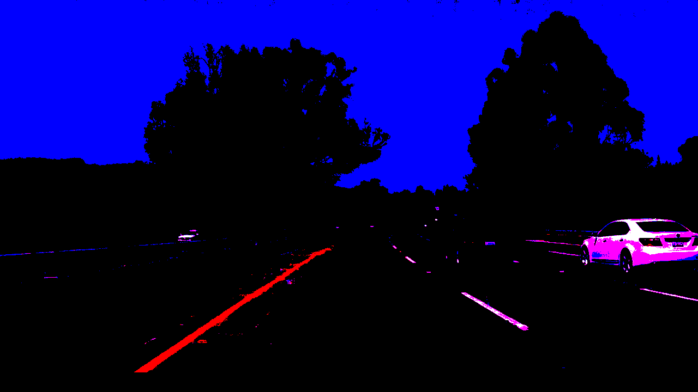

# **Finding Lane Lines on the Road** 

## Writeup Template

### You can use this file as a template for your writeup if you want to submit it as a markdown file. But feel free to use some other method and submit a pdf if you prefer.

---

**Finding Lane Lines on the Road**

The goals / steps of this project are the following:
* Make a pipeline that finds lane lines on the road
* Reflect on your work in a written report

[//]: # (Image References)

[image1]: ./examples/grayscale.jpg "Grayscale"

---

### Reflection on pipelines and project 

My pipeline consisted of 7 steps. First, I
1) split up the image into R,G,B channels and applied different thresholds
to channels in order to eliminate the noise primarely on challenge video. Then I combined all the channels together again in the image. The result image lookes like this:

You can see how most of the noise is gone (this is one of the challenge video's frames)

Then I: 
2) converted the image into a grayscale one
3) de-noised it by appying Gaussian kernel with size = 5
4) applied Canny edge detection algorithm to get all edges
5) applied region of interest to filter out features which
do not belong to a lane. The region of interest is built relative to
an image size to work in images of different resolutions
6) applied Hough operator to get the segments on a same lines
7) and overlayed them on top of an original picture with some trasparency mask
 
In order to draw a single line on the left and right lanes, I modified the draw_lines() function by 
1) filtering out all the lines that are not in a polygon of an interest
2) determining min/max slope and sorting out all the lines into two buckets: left lines and right lines
3) average across all the lines correspodingly in left and right buckets to get an average slope and 
(top, left) and (top, right) points of segments
4) determining intersection points with the bottom horizontal line of a picture img.shape[1] by having a slope
and one point on a line
5) drawing a line from bottom intersection points to (top, left) and (top, right) points of segments

### 2. Potential shortcomings with my current pipeline

There are several potential shortcomings related to the approach I've chosen:
1. It can not reliably detect lanes going in directins different from the ones we have in this project:
perpendicular, diagonal.
2. It is somewhat sensitive to a noise in a specturm close to lane color (yellow, white). I've tried to eliminate some of it 
by applying filters.
3. The pipeline also does not work well for curved lanes detection, so any turn or road curve would not look nice.
4. This pipeline would not work great under conditions where gradient between lanes and a road surface is not substantial: like white lanes on concrete surface

### 3. Possible improvements to my pipeline

A possible improvement would be to apply a geomtetric model to a line detection, they all have distinct geometric 
shapes: solid, dotted lines, the gaps between segments are farely regular and I believe are mostly maintained as it impacts driver safety. 
Another imporvement would be to detect noise and apply different image filters in this case. I've toyed with this idea a bit and got some success but one could imagine some kind of adaptive filtering would probably work better.
Also I'm kind of speculating here but one could imagine that line detection would work better when temporal frame to frame changes are taken into consideration. But that would be an entireley new class of algorithmes.

